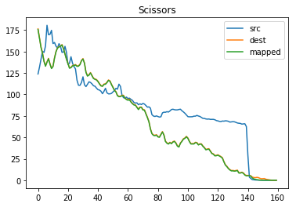
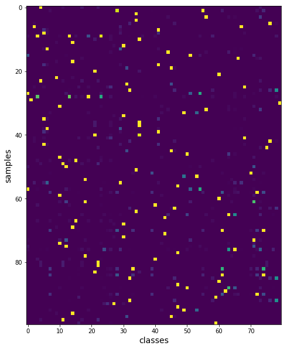

# Kaggle Freesound Audio Tagging 2019 Competition Solution


This is a solution for [Kaggle Freesound Audio Tagging 2019 Competition](https://www.kaggle.com/c/freesound-audio-tagging-2019/):

- Multi label classification of audible raw sound data samples.
- Providing two different training datasets which makes this problem difficult; clean curated set and noisy set.

Basic strategy of this solution is:

- Solving problem as image classification with multi label image classifier CNN models, so that making task as popular problem; It makes various matured techniques for images available.
- Using rich audio feature representations; Mel-spectrogram and its phase, free sound duration and background removal.
- Using [fast.ai](https://www.fast.ai) library for quicker training & development.

I already have open-sourced basic part of what I'm doing as following public tutorial kernels,
this solution is super-set of them.

- [CNN 2D Basic Solution Powered by fast.ai](https://www.kaggle.com/daisukelab/cnn-2d-basic-solution-powered-by-fast-ai)
- [Creating FAT2019 Preprocessed Data](https://www.kaggle.com/daisukelab/creating-fat2019-preprocessed-data)
- [CNN 2D Basic #3 using Simple Model](https://www.kaggle.com/daisukelab/cnn-2d-basic-3-using-simple-model)
- [CNN 2D Basic #2, Preprocessed Dataset, Noisy](https://www.kaggle.com/daisukelab/cnn-2d-basic-2-preprocessed-dataset-noisy)
- [Verifying CNN Models with CAM and etc, fast.ai](https://www.kaggle.com/daisukelab/verifying-cnn-models-with-cam-and-etc-fast-ai)

## 0. Solution outline

Followings outlines solution steps. Major items are explained in following sections, and all the codes are basically available.
In the following list, prefix _Worked_ or _Not sure_ are given to denote that it have confirmed to be working fine or cannot be sure for now (but still interesting).

1. Audio preprocessing
    - _Worked_: Convert to mel-spectrogram based image format, and 3 formats available
    - _Not sure_: Background subtraction - AAA format only
    - _Not sure_: Data domain transfer - noisy set only; an attempt to mitigate differences between data domains

2. Dataset preprocessing
    - _Worked_: Soft relabeling with Co-occurrence probability
    - _Not sure_: Data train/valid split

3. Training
    - _Worked_: Mixup extension to mix with noisy samples
    - _Worked_: Basic transfer learning scheme.

4. Ensemble

### To reproduce by yourself

CAUTION: Exact steps are not provided (due to lack of time to test...), you might see some errors if you try. Will be fixed upon future requests.

1. Preprocess audio.
2. Preprocess dataset.
3. Pre-train.
4. Train final models.
5. Do ensemble and submit.

### Major source codes

- lib_fat2019.py - Most of function/class implementations.
- audio_utils.py - Audio preprocessing utilities.
- domain_freq_xfer.py - Data domain transfer class.
- private_models.py - Private small model definition.

### Folders

This solution uses following folders.

- conf.DATA - Competition dataset folder; '../input/freesound-audio-tagging-2019'
- conf.ROOT - This repository root. Some .csv files that will be created by meta data preprocessing will also be stored here
- conf.WORK - Working file folder
- `base_models` - When running `app_*.py`, this folder will be used to load pre-training model weights.

## 1. Audio preprocessing

Source code: [preprocess_mels_160_1sAPD.py](preprocess_mels_160_1sAPD.py)

### 1-1. Convert to mel-spectrogram image format

- [Visual Data Gallery available as notebook](Visual_Data_Gallery.ipynb) will show you whole picture visually.
- 3 image formats were used and two are newly invented for this competition;
    - AAA: All amplitude of mel-spectrogram.
    
    - APX: Amplitude, phase and elementwise multiplication of amplitude and phase.
    
    - APD: Amplitude, phase and delta of amplitude. This is most interesting format I tried. Example) 'Bark'
    
- APD format is the default, preprocessed audio is stored as 1s duration unit APD. The `load_fat2019_X()` function converts from this 1s APD to other desired format while loading, and also converts duration unit from 1s to any desired time length as well. This makes quick attempts for various audio formats possible.

### 1-2. Background subtraction - AAA format only

This is available for AAA format only, painting stationary part of sound with zero; intended to make models to focus on sound events only. Example) 'Bark'

- Original sound in AAA format.

- After background subtraction applied.


### 1-3. Data domain transfer - noisy set only

This is an attempt to mitigate data domain difference between noisy and curated set, based on __average power spectrum__ which is calculated by averaging spectrogram over time.

- [Visual Average Spectrum Conversion Gallery available as notebook](Visual_Average_Spectrum_Conversion_Gallery.ipynb)
- This converts average spectrum of each sample from noisy to curated regime.

    

    _`src`_ is noisy set spectrum mean, _`dest`_ is curated's, and _`mapped`_ is average spectrum mapped from noisy to curated according to the design above. As you can see _src_  average spectrum is mapped to _dest_ which is almost overlapped by _mapped_ average spectrum.

#### Update on June-13

- Changed to call basic idea from 'frequency envelope' to 'average power spectrum' for better description. Initial idea comes from adapting frequency envelope, but what was done is actually adapting average of spectrum.
- But doubt of bug found in this technique by visualizing converted spectrograms. See the bottom part of the [Visual Average Spectrum Conversion Gallery](Visual_Average_Spectrum_Conversion_Gallery.ipynb).

## 2. Dataset preprocessing

### 2-1. Soft relabeling with Co-occurrence probability

In early EDA observation, it is found that multi label annotation seems to be inconsistent in some samples and this inconsistency also seems to be depending on classes.

I had a hypothesis that label inconsistency is coming from annotators' different understanding of classes, and instability as human being when they are giving labels to the samples.
Then this attempt tried to model it with very simple way that classes has some probability to come with other classes. This is calculated by counting frequency of occurrence of other classes.

[Visual Cooccurrence Probability Soft Relabeling Gallery](Visual_Cooccurrence_Probability_Soft_Relabeling_Gallery.ipynb) will describe some more.

Basic effect of this relabeling is regularization or augmentation. Training curve behaves like when mixup is applied.

#### Hard label example

If we plot labels as a dot (columns) for each samples (rows), following is example for first 100 samples of curated training set.


#### Soft label example

This shows soft labels which replaced hard labels with co-occurence probability.



### 2-2. Data train/valid split

Dataset was re-assembled as follows:

- TRN_CURATED: Curated set as is.
- TRN_NOISY: Noisy set's all samples as is.
- TRN_NOISY_SINGLE: 100 samples per class, randomly picked single label from multi labels.
- TRN_NOISY_BEST50S: 50 single samples per class. Some classes were oversampled.

And because this competition ws very peaky regarding data split, I set strict split attribute to each samples, by making 'train' or 'valid' column on csv meta data files.

- TRN_CURATED: Two valid sets are defined.
- TRN_NOISY/TRN_NOISY_SINGLE/TRN_NOISY_BEST50S: Train/valid are assigned to samples.

Source code: [Preprocess_Dataset.ipynb](Preprocess_Dataset.ipynb)

There's one of difficult part of this competition problem setup: multi-label makes it difficult to class-balanced split, training sample has two different curated/noisy sets.

## 3. Training

Training was made by following steps:

1. Pre-training: get pre-trained model first, for two different models.
2. Training on target set: then train models on curated set (and some small number of samples from noisy set), models are initialized with pre-trained weights beforehand.

### 3-1. Mixup extension to mix with noisy samples

As [discussed in the forum](https://www.kaggle.com/c/freesound-audio-tagging-2019/discussion/91827), a paper "[MixMatch: A Holistic Approach to Semi-Supervised Learning](http://arxiv.org/abs/1905.02249)" seemed to be promising.
Unfortunately attempt for bringing MixMatch was incomplete, then implementation was used for _super_ version of "[mixup: Beyond Empirical Risk Minimization](https://arxiv.org/abs/1710.09412)."

Mixup was essential to avoid overfitting. It was used in all trainings.

- `conf.MIXUP_ALPHA` > 0 will do Mixup in between training samples (mostly from curated set).
- `conf.MIXMATCH_ALPHA` > 0 will do MixMatch like Mixup; training samples or noisy samples will be mixed.

### 3-2. Training details

#### Models

- _specgram_: Hand crafted small model, resemble to the historical AlexNet.
- _DenseNet121_: As a handy big-enough model, used with augmentation techniques not to overfit too much.

#### Pretraining

- Trained with TRN_NOISY set.
- Used all samples from noisy set to get better models. It overfits or gets less representation capability if trained with smaller subset. Even if it looks good training curve, models trained based on these pretrained models resulted in less-performance, confirmed at least with 3 attempts.
- Source code: `base_*.py`

#### Training

- Training for final application uses TRN_CURATED & TRN_NOISY_SINGLE sets.
- Source code: `app*.py`

See training source codes for other details like training parameters.
`fat2019_initialize_training()` in `lib_fat2019.py` is the one most import function to understand implementation.

## 4. Ensemble

- All trained models' predictions are ensembled as follows.

    ```python
    def learner_predict_test(learner_pkl_file, tta=10, tta_mode=2):
        df, _, learn = create_learner_by_weight(conf, learner_pkl_file,
                                                work=conf.WORK, for_what='test')

        X_test = load_fat2019_X(conf, conf.MELSP_TEST)
        print(f'Using {conf.MELSP_TEST} as X_test')
        test_df = pd.read_csv(conf.CSV_SUBMISSION)
        preds = predict_fat2019_test(learn, conf.WORK, 'sample_submission.csv',
                                     X_test, test_df, n_oversample=tta, tta_mode=tta_mode)

        return preds

    list_preds = [learner_predict_test(fn, tta=10, tta_mode=2)
                  for fn in model_files]
    mean_preds = arithmetic_mean_preds(list_preds)
    ```

- Per class and per model weighting mean was also done and found to be effective. Models' lwlrap per class score is used to determine weights for model results.

    ```python
    # Use this instead of arithmetic_mean_preds(list_preds)
    model_csvs = [Path(f.replace('.pth', '.csv')) for f in model_files]
    model_scores = np.array([pd.read_csv(f).lwlrap.values for f in model_csvs])

    mean_preds = model_class_weighted_mean_preds(list_preds, model_scores)
    ```

## 5. Closing comment

At the final part of the competition to achieve top performance requires careful training data selection scheme, and that is not covered by this solution.

This solution mainly focuses on audio domain techniques and high performance classification using Mixup (and MixMatch) and fast.ai library, for making sound classification tasks can be resolved with better performance easily.

I hope some techniques invented here could be useful or any of hints to other similar problems or applications.

## X. Future plan

- (Hopefully) Complete MixMatch implementation for fast.ai for reproducing original paper's results.
- (TBD) Merging outcomes to [ml-sound-classifier](https://github.com/daisukelab/ml-sound-classifier) repository, it is 2018 solution based sound classifier application.

